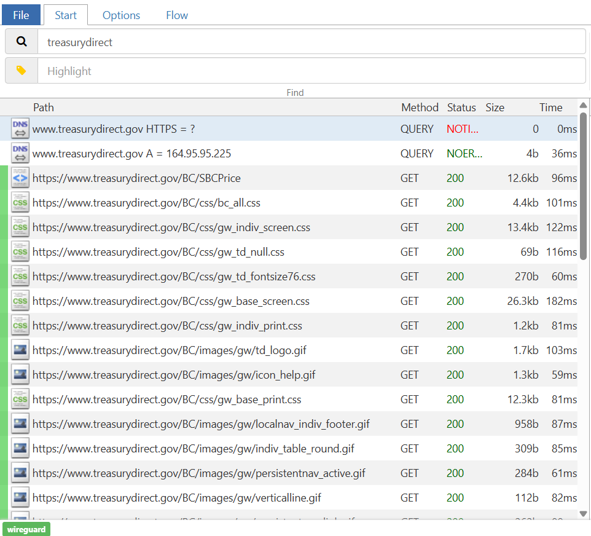

# Treasury Direct API

I have yet to find a financial management app that can successfully get your data from Treasury Direct. Typically, it connects once, and then you have to enter the OTP every time it tries to update.

This repository has two goals:

1.  Show how I think this problem should be solved.
2.  Showcase using a GenAI agent to successfully reverse-engineer and build an API.

---

## The Solution

My proposed solution is a more stable, two-stage process:

1.  **Login and Scrape:** The user logs into their Treasury Direct account once, providing their credentials and OTP. The application then scrapes and stores a complete list of all bonds they hold.

2.  **Update Values:** To get the current value of these bonds, the application calls a separate, public Treasury API endpoint that *doesn't* require logging in. This can be done as often as needed without user intervention.

3.  **Re-sync Holdings:** If the user buys or sells bonds, they can simply hit a button to re-authenticate and provide an OTP again to update their list of holdings.

I believe this is the best solution. It doesn't require the user to enter all of their bonds by hand, and it avoids the brittleness of trying to keep a connection alive (which is where other sites fall short). It also means we don't have to build a complex tool to calculate bond values, which would need to account for things like 3-month interest delays for I-bonds and changing rates.

---

## The GenAI Agent

I've reverse-engineered a lot of APIs. The tricky part is always following through, figuring out where variables came from, and what REST requests you have to call to perform the tasks you want. It's not a super difficult process once you learn the tools, but it takes a bit to learn what to look for.

My hope with this project was to make a quick and easy proof-of-concept of a GenAI agent that handles figuring out what requests are important, what variables you need, and what order to do things in.

Once I realized that GenAI could pretty easily solve this task, I decided to throw an extra challenge at it: **actually building the API!** This would prove two things:

1.  That all the important information was successfully extracted into the documentation. If any critical step was missing, the AI-created API would fail.
2.  That the agent is capable of making the API so long as it has all the needed information.

### How does it work?

The process starts with capturing the network traffic from a successful login.

1.  **Capture Traffic:** You start by setting up [mitmproxy](https://mitmproxy.org/). I prefer to use it in [WireGuard mode](https://mitmproxy.org/posts/wireguard-mode/) as it allows for transparent proxying and can help with more challenging APIs. Connect your device and perform the task you want to automate (in my case, logging into Treasury Direct).

2.  **Filter and Save:** Next, you filter the requests down to just the ones you care about and save them. The AI agent could probably handle this, but I think it's easier to just help it out.

3.  **The Agent's Task:** Now is where the agent does its problem-solving. It loads the saved requests (called "Flows" in mitmproxy's terminology) and has access to three simple tools:
    * `Create Documentation`: Generates documentation for a given Flow.
    * `Update Documentation`: Updates existing documentation with new info.
    * `Find String`: Searches across all Flows to find where a specific value appears (very simply, could definitely be more complex).

4.  **The Process:** The agent calls these tools on repeat until it thinks it has completed the task. It has access to any documentation it has already created and continues searching for strings until it has mapped out the entire process. For this example, it goes something like this:
    *Search for the username.* -> *See that a `_csrf` variable is needed.* -> *Find the flow where the `_csrf` variable is returned.* -> *Determine if anything is needed to get that flow * -> *Document that flow.* -> *Update the login documentation to note the dependency.*

5.  **API Generation:** Finally, once you have all the relevant information documented, you simply instruct the agent to `create_api`, and it will use the markdown files it generated to create a working client.

This was a fun experiment I did in about a day. If anyone comes across this and wants to do it themselves, there are definitely a lot of improvements I would make in a 'real' system (more tooling, prompt optimization, etc.) - feel free to reach out.

As an additional note - the documentation has been heavily redacted - everything in there has been changed to NOT match my values - so somethings may not be accurate in a real world system.